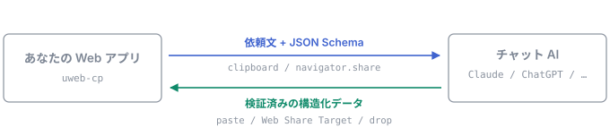

# uweb-cp

[](https://github.com/kuu13580/uweb-cp/actions/workflows/ci.yml)
[](./LICENSE)
[](./packages/core/package.json)

**µweb-cp — Micro Web Context Provider.** Web 標準だけで、アプリと「利用者が普段使っているチャット AI」の間を構造化データで往復させる TypeScript ライブラリ。

サーバも API キーも常駐プロセスも不要。運び手は利用者自身（共有シート / コピー&ペースト）。



## インストール

```sh
npm i uweb-cp
```

ランタイム依存はゼロ。検証だけ [Standard Schema](https://standardschema.dev/) 準拠のものを持ち込みます。

## 何を解決するか

「スマホの AI アプリで旅行の日程を詰めて、決まった内容をそのままアプリに取り込みたい」——
この 1 往復のためだけに MCP サーバやローカル LLM を立てるのは重すぎる。
µweb-cp は **利用者を転送路として使う**ことで、インストール 0・設定 0 でこの往復を成立させる。

## 使用イメージ

```ts
import { defineContract, createExchange } from 'uweb-cp'

const itinerary = defineContract<Itinerary>({
  id: 'trip.itinerary',
  description: '旅行の日程表',
  jsonSchema: {/* ... */},
  validate: itinerarySchema, // zod / valibot など Standard Schema 準拠なら何でも
})

const exchange = createExchange({ contract: itinerary })

// 1. アプリ → AI: 共有シートかクリップボードで依頼文を送り出す
await exchange.send({ context: { destination: '金沢', nights: 2 } })

// 2. AI → アプリ: 返信テキストを受け取って検証済みデータにする
exchange.listen((result) => {
  if (result.ok) importItinerary(result.value.envelope.data)
})
```

## 試してみる

この端末で実際に往復させられます。条件を送って AI に渡し、返ってきた返信を貼り付けると、
検証済みの構造化データとして取り込まれます。

<!-- demo:start -->

→ **[ライブデモを開く](https://kuu13580.github.io/uweb-cp/)**（スマホでも動きます）

<!-- demo:end -->

## 設計の軸

|                          |                                                                      |
| ------------------------ | -------------------------------------------------------------------- |
| **転送路はテキストのみ** | チャット UI のコピー&ペーストを通過できるものしか使わない            |
| **人間がループに入る**   | API キー・CORS・サーバが要らない代わりに、送信ボタンを押すのは利用者 |
| **フレームワーク非依存** | Web API のみ。React/Vue/Svelte いずれからも使える                    |
| **検証は持ち込み**       | Standard Schema 準拠なら zod でも valibot でも arktype でも可        |

## スコープ外

- ローカル LLM（Ollama / llama.cpp 等）への直接中継 — 対象は**利用者の手元にある一般向けチャットアプリ**
- LLM の自律的なツール呼び出し — それは MCP の領分

## ドキュメント

- [アーキテクチャ](./docs/architecture.md) — 4 層構成と、設計の前提になっている環境制約
- [UCP-1 封筒フォーマット](./docs/protocol.md) — 往復フォーマットと探索規則
- [設計判断の記録 (ADR)](./docs/adr/) — なぜそうしたか

手を入れる人は [CONTRIBUTING](./CONTRIBUTING.md)。

## ライセンス

MIT
